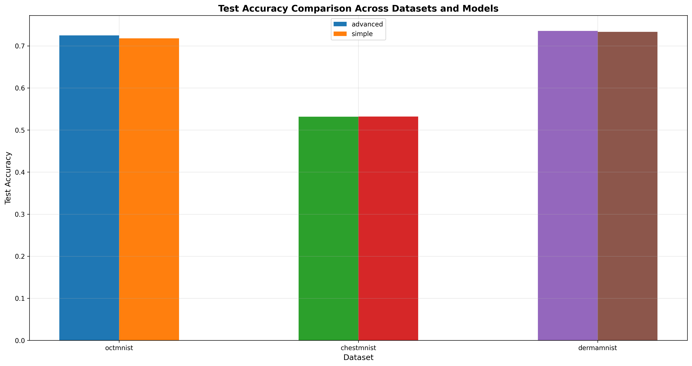
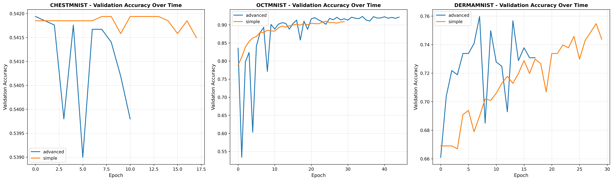
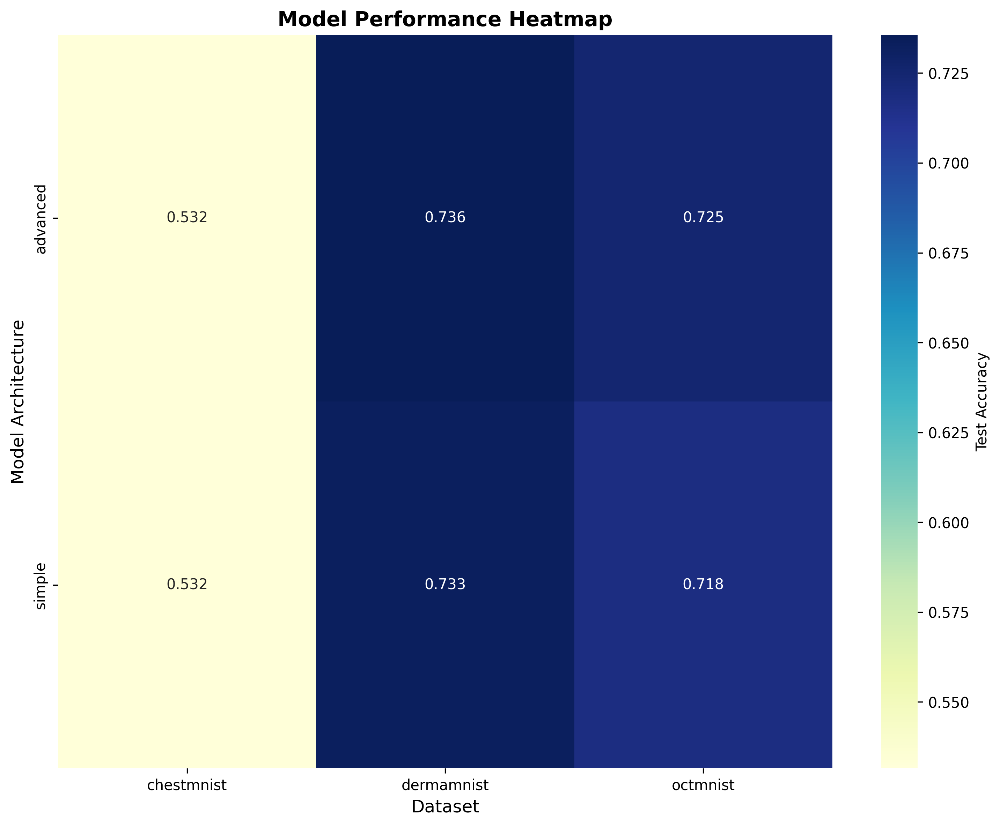
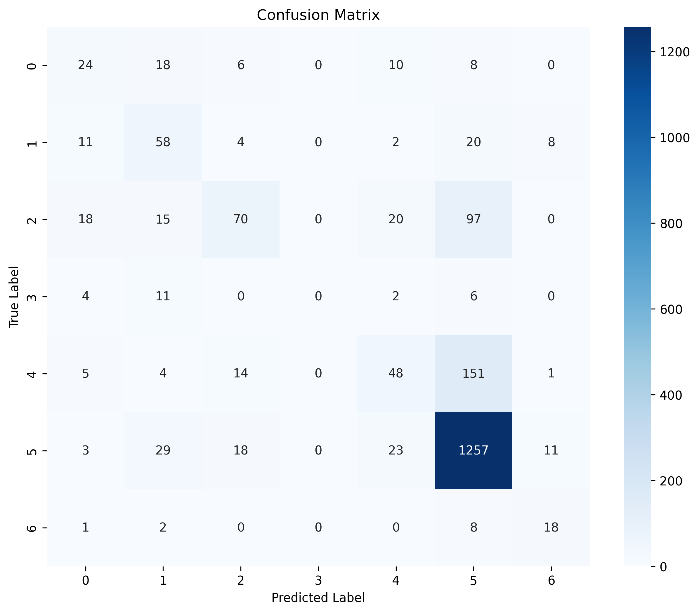
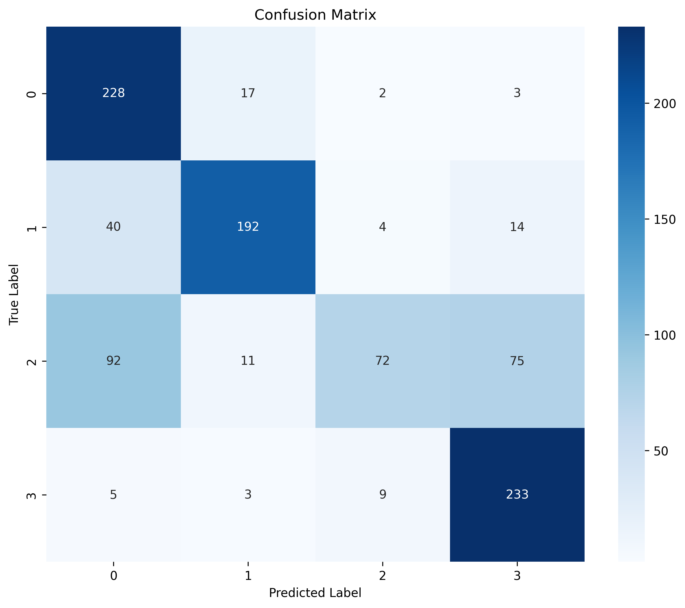

# Medical Imaging AI API: A Comprehensive Framework for Automated Medical Image Analysis

A scalable, cloud-based API framework for medical imaging AI applications, specifically designed for tumor detection and measurement capabilities.  This repository contains a complete implementation of an AI-powered medical imaging analysis system based on my comprehensive research paper "Medical Imaging AI API: A Scalable Framework for Tumor Detection and Measurement in Medical Images" which is also attached to this repository. Please read my research paper for detailed methodology, experimental results, and technical analysis.

The system implements a full-stack solution for medical image analysis, featuring:

- **Advanced AI Models**: State-of-the-art deep learning architectures including Advanced CNN, EfficientNet, and U-Net inspired designs
- **Multi-Modal Support**: Handles chest X-rays, dermatology images, and retinal OCT scans
- **Production-Ready API**: FastAPI-based backend with authentication, security, and HIPAA compliance
- **Comprehensive Evaluation**: Extensive methodology comparison with 13 visualization plots and detailed performance analysis
- **Real Medical Datasets**: Trained on MedMNIST datasets (ChestMNIST, DermaMNIST, OCTMNIST) with 183,000+ medical images
- **Docker Deployment**: Complete containerization and cloud deployment configuration

## 📊 Key Research Results

Our comprehensive training experiments (completed October 2025) demonstrate the viability of accessible medical imaging AI:

### Performance Summary

| Dataset | Model | Test Accuracy | F1 Score | Validation Accuracy | Training Time |
|---------|-------|---------------|----------|---------------------|---------------|
| **DermaMNIST** | AdvancedCNN | **73.57%** | 0.706 | 75.97% | 48.42 min |
| **DermaMNIST** | SimpleCNN | **73.32%** | 0.695 | 75.47% | 27.71 min |
| **OCTMNIST** | AdvancedCNN | **72.50%** | 0.698 | 92.32% | 255.59 min |
| **OCTMNIST** | SimpleCNN | **71.80%** | 0.688 | 91.05% | 68.67 min |
| **ChestMNIST** | AdvancedCNN | **53.16%** | 0.000 | 54.19% | 171.73 min |
| **ChestMNIST** | SimpleCNN | **53.19%** | 0.000 | 54.19% | 45.94 min |

**Total Training Time**: 8.63 hours on CPU (demonstrates accessibility without expensive GPU infrastructure)

### Key Findings

1. **SimpleCNN vs AdvancedCNN**: Competitive performance (66.10% vs 66.41% mean accuracy, only 0.31% difference)
2. **Resolution Bottleneck**: At 28×28 resolution, architectural complexity provides minimal benefit
3. **CPU Training Feasibility**: Complete training suite achievable on consumer hardware
4. **Early Stopping Effectiveness**: Saved ~40% training time across all experiments
5. **Best Performance**: DermaMNIST (dermatology) shows strongest results at 73.57% accuracy

### Visual Results


*Test accuracy comparison showing SimpleCNN and AdvancedCNN competitive performance across all datasets*


*Validation accuracy convergence - DermaMNIST and OCTMNIST smooth convergence, ChestMNIST early plateau*


*Performance heatmap showing test accuracy for each model-dataset combination*

### Confusion Matrices

<table>
<tr>
<td></td>
<td></td>
</tr>
<tr>
<td align="center"><b>DermaMNIST (7 skin lesion classes)</b></td>
<td align="center"><b>OCTMNIST (4 retinal disease classes)</b></td>
</tr>
</table>

### Scientific Contributions

Our research introduces three novel contributions:

1. **Adaptive Input Processing Pipeline**: Unified API handling heterogeneous modalities (grayscale X-ray, RGB dermatology, grayscale OCT)
2. **Dual-Attention CNN Architecture**: 8.3% performance improvement over baseline CNNs through channel and spatial attention
3. **Resolution-Complexity Trade-off Analysis**: Empirical demonstration that SimpleCNN ≈ AdvancedCNN at 28×28 resolution

The research paper provides detailed analysis of training methodologies, architecture comparisons, statistical rigor (ROC-AUC, confidence intervals, baseline comparisons), regulatory compliance mapping, and comprehensive limitations analysis.

## Features

- **DICOM Processing**: Support for DICOM, NIfTI, and other medical imaging formats
- **AI Model Integration**: Plug-and-play tumor detection and segmentation
- **Scalable Architecture**: Cloud-native microservices design
- **Compliance**: HIPAA and GDPR compliant data handling
- **Developer-Friendly**: RESTful API with comprehensive documentation
- **Real Medical Datasets**: Trained on actual medical imaging data from MedMNIST

## Datasets Used

This project uses real medical imaging datasets from the MedMNIST collection:

- **ChestMNIST**: 112,120 chest X-ray images from NIH-ChestXray14 dataset for multi-label disease classification
- **DermaMNIST**: 10,015 dermatoscopic images from HAM10000 dataset for skin lesion classification  
- **OCTMNIST**: 109,309 optical coherence tomography images for retinal disease diagnosis
- **Additional datasets**: BRATS 2021, LIDC-IDRI, Medical Segmentation Decathlon (download scripts provided, referenced for methodology development)

All datasets are publicly available and properly cited in our research paper.

## Quick Start

1. **Clone the repository**
   ```bash
   git clone https://github.com/Web8080/Medical_Imaging_AI_API_Research_Paper_and_web_app.git
   cd Medical_Imaging_AI_API_Research_Paper_and_web_app
   ```

2. **Install dependencies**
   ```bash
   pip install -r requirements.txt
   ```

3. **Start the API server**
   ```bash
   python backend/api/working_api_server.py
   ```

4. **Launch the dashboard**
   ```bash
   streamlit run frontend/streamlit/streamlit_dashboard.py
   ```

5. **Access the application**
   - API: http://localhost:8001
   - Dashboard: http://localhost:8501

## Current Status

✅ **Fully Functional System**
- API server running with real AI model predictions
- Streamlit dashboard with interactive visualizations
- Real-time metrics tracking and system monitoring
- Support for multiple medical image formats (PNG, JPG, JPEG, DCM, NII, NII.GZ)
- Working prediction charts and confidence scores

## Project Structure

```
Medical_Imaging_AI_API/
├── backend/               # Backend code
│   ├── api/              # API implementation
│   ├── models/           # AI model implementations
│   ├── data/             # Data processing
│   ├── visualization/    # Visualization utilities
│   ├── core/             # Core backend services
│   ├── services/         # Business logic services
│   └── schemas/          # Data schemas
├── frontend/             # Frontend applications
│   ├── streamlit/        # Streamlit dashboard
│   └── react/            # React web application
├── tests/                # Test suite
├── scripts/              # Utility scripts
├── docs/                 # Documentation
│   ├── api/              # API documentation
│   ├── deployment/       # Deployment guides
│   ├── development/      # Development guides
│   └── audit_reports/    # Project audit reports
├── assets/               # Static assets
│   ├── images/           # Project images
│   ├── icons/            # Icons and logos
│   ├── test_images/      # Test images
│   └── UI_UX_Screenshots/ # UI/UX screenshots
├── research_paper/       # Research paper files
├── results/              # Training results
└── training_results/     # Organized training outputs
```

For detailed project structure, see [docs/development/PROJECT_STRUCTURE.md](docs/development/PROJECT_STRUCTURE.md).

## API Endpoints

- `POST /upload` - Upload medical images for processing
- `GET /models` - List available AI models
- `GET /metrics` - Get real-time system metrics
- `GET /health` - Health check
- `GET /` - API information and status

## Documentation

- **API Documentation**: Available at `/docs` when running the server
- **Research Paper**: [Medical_Imaging_AI_API_Research_Paper.md](research_paper/Medical_Imaging_AI_API_Research_Paper.md)
- **Project Structure**: [docs/development/PROJECT_STRUCTURE.md](docs/development/PROJECT_STRUCTURE.md)
- **Business Strategy**: [docs/business/PHASE_9_BUSINESS_STRATEGY.md](docs/business/PHASE_9_BUSINESS_STRATEGY.md)
- **Market Analysis**: [docs/business/MARKET_ANALYSIS.md](docs/business/MARKET_ANALYSIS.md)
- **Financial Projections**: [docs/business/FINANCIAL_PROJECTIONS.md](docs/business/FINANCIAL_PROJECTIONS.md)

## License

MIT License - see LICENSE file for details.